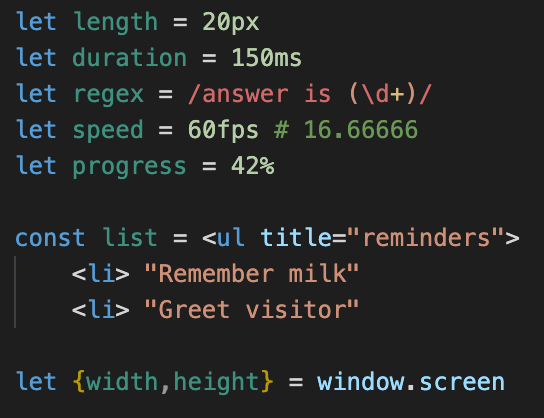
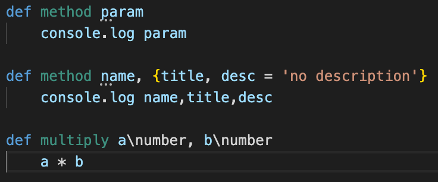
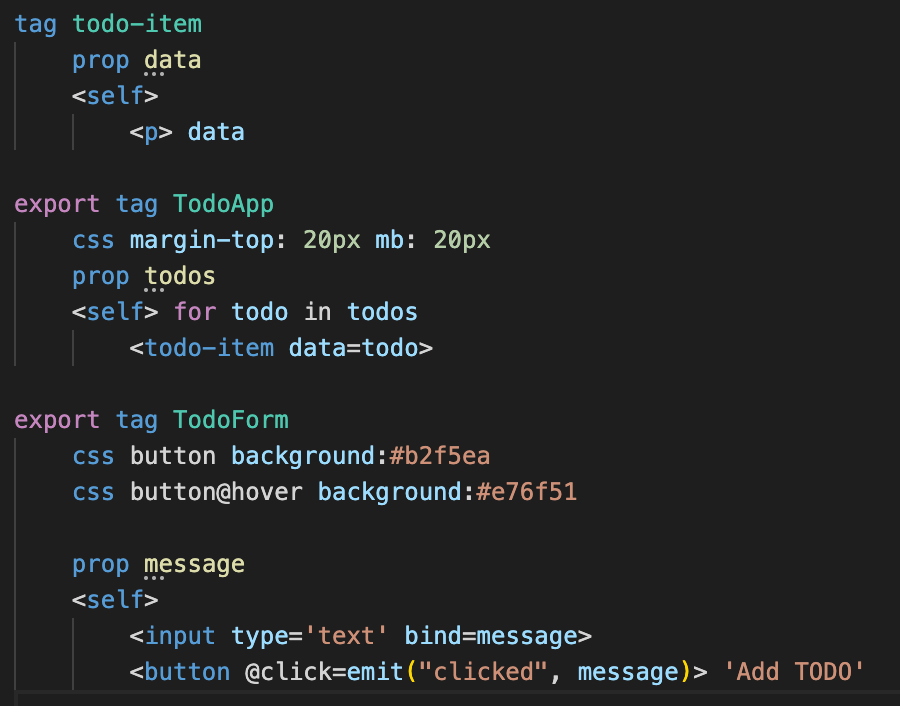
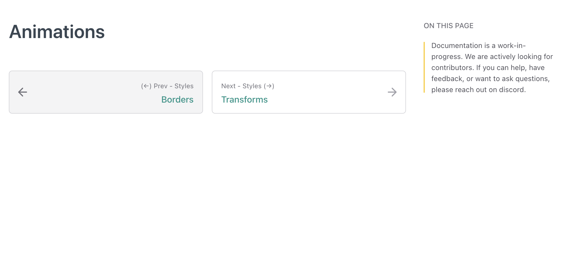
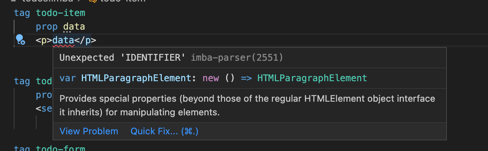
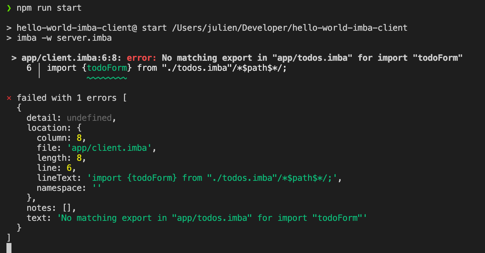
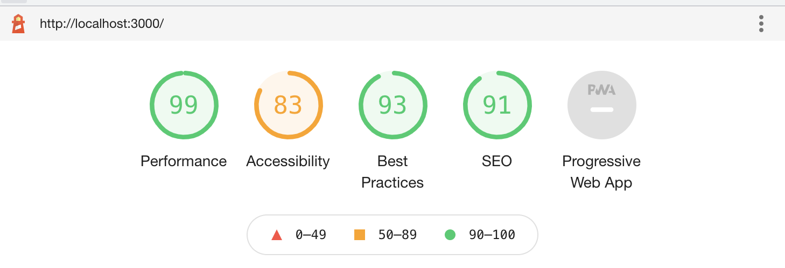

# Imba : Le développement web rapide rapide

---

## En 2 secondes

* Compile vers du JavaScript
* Rapide rapide :) (Syntaxe efficace, DOM memoization)
* Node, NPM (tout l'écosystème reste disponible)
* Front and Back end

---

## La genèse

* Imba a été crée par Scrimba. 
* Tout le site est basé sur cette stack.
* Tutoriels interactifs pour remplacer les bootcamps

---

## Prise en main : Le top! 

* Zero config
* WebApp ou electron avec HelloWorld
* Un plugin VSCode avec tous les goodies habituels
* Live reloading, build, ... Pas de tests?

---

## Quelques goodies : Les types de variables

---

## Fonctions et inférence de types

---

## Tags et Components

---

## Gestion des évènements

---

## Une doc facile à lire mais parfois incomplète

---

## Des erreurs ... déconcertantes

---

## Des erreurs ... en JSON!

---

## Performance : TODO app

---

## Conclusion

* DOM lisible 
* Syntaxe -> productif
* Très reconnaissable pour le dév lit
* Niche et manque de ressources